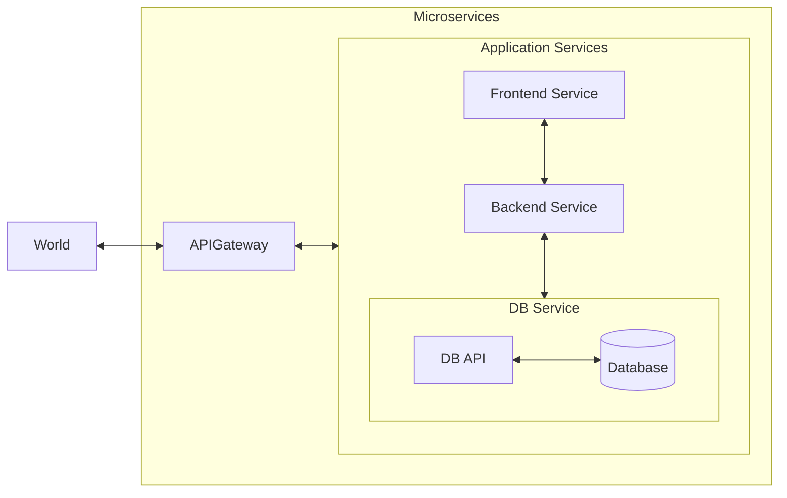

# The Spring Boot Microservices Project

## Architecture

```mermaid
flowchart LR
 subgraph DBSvc["DB Service"]
    direction LR
        API["DB API"]
        DB[("Database")]
  end
 subgraph AppSvc["Application Services"]
    direction TB
        Frontend["Frontend Service"]
        Backend["Backend Service"]
        DBSvc
  end
 subgraph Microservices["Microservices"]
    direction LR
        AppSvc
        APIGateway["APIGateway"]
  end
    APIGateway <--> AppSvc
    Frontend <--> Backend
    Backend <--> DBSvc
    API <--> DB
    World["World"] <--> APIGateway
```

## Repo Tree

To-Do after MS completion.

> To Be Generated by [RepoTree](https://ascii-repotree.vercel.app/)
